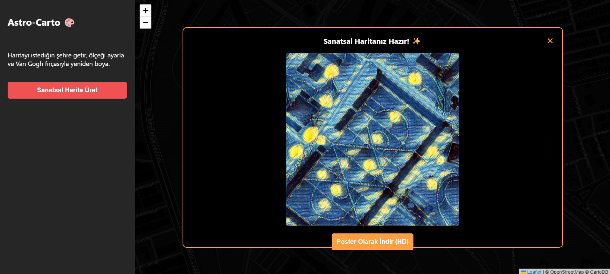

# Astro-Carto 🎨

İstediğin şehri haritada seç, Van Gogh tarzı bir nöral stil transferiyle sanatsal bir harita posterine dönüştür.

## 🚀 Canlı Demo

**[Buradan direkt dene →]([https://astro-carto.onrender.com](https://astro-carto.onrender.com))**

## 📸 Önizleme

| Alanı seç | Sanatsal sonucu al |
|---|---|
|  |  |

## ✨ Nasıl çalışır?

1. Harita üzerinde istediğin bölgeye gel — ekrandaki kesikli çerçeve haritalanacak alanı gösterir.
2. **"Sanatsal Harita Üret"** butonuna bas.
3. Backend, o çerçevenin kapsadığı gerçek coğrafi alanı (bounding box) hesaplar, ilgili harita karolarını (tile) indirip birleştirir.
4. OpenCV ile önceden eğitilmiş bir nöral stil transfer modeli (`starry_night.t7`) bu görüntüye uygulanır.
5. Sonuç, indirilebilir bir poster olarak gösterilir.

## 🛠️ Kurulum

```bash
# Depoyu klonla
git clone https://github.com/KULLANICI_ADIN/REPO_ADI.git
cd REPO_ADI

# Sanal ortam oluştur (opsiyonel ama önerilir)
python -m venv venv
source venv/bin/activate      # Windows: venv\Scripts\activate

# Bağımlılıkları kur
pip install -r requirements.txt
```

### Model dosyası

Bu proje `models/starry_night.t7` adlı bir nöral stil transfer modeli gerektirir. Bu dosya depoya dahil değildir. Modeli indirip `models/` klasörüne yerleştirmen gerekir.

### Çalıştırma

```bash
python app.py
```

Ardından tarayıcıdan `http://127.0.0.1:5000` adresine git.

## 🧰 Kullanılan teknolojiler

- **Backend:** Flask, OpenCV (DNN modülü), Pillow, NumPy
- **Frontend:** Leaflet.js, CartoDB Dark tile katmanı
- **Harita verisi:** CartoDB açık tile sunucusu (API anahtarı gerekmez)

## 📄 Lisans

Bu projeyi istediğin gibi kullanabilir, değiştirebilirsin.
